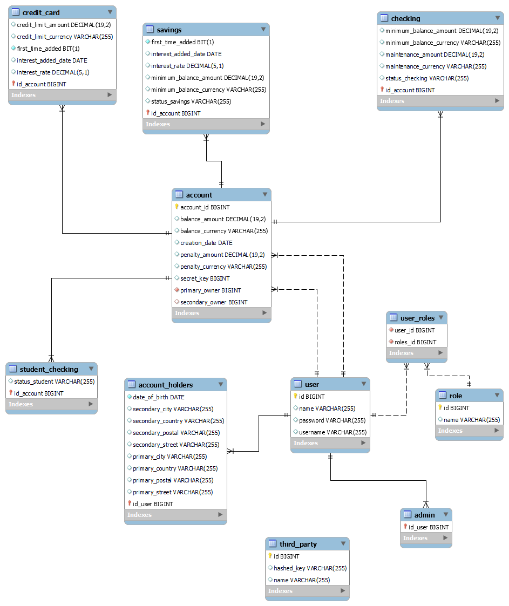

# Midterm Project

## Description of the project

This REST API represents a banking system. It can create new users, that can have the role of admins, account holders or third party users. Each role has a different level of authority to perform various tasks.
The admin can create, update, see and delete every user and account, and add a role to a user. The account holder only can see and modify the balance and transfer money from one of the accounts. And the third party can receive and send money.

It can also create different types of accounts, like Checking accounts, savings accounts, credit cards accounts and student checking account.
The students checking accounts is created when the account holder is less than 24 years old. The system deduct a specific penalty fee if the balance is below the minimum and add the interest rate after a year or a month, dependint the type of account.

To execute this functionalities it is necesary to know the routes that will be shown below.

## Technologies Used

This project was created with Java, Spring Boot and Spring Data JPA to include the SQL queries. The API was tested with Postman and with JUnit.

## Models
This API has ten models, five for the accounts and five for the users:

Account
* Account (Abstract)
* Checking (extends account)
* Credit Card (extends account)
* Savings (extends account)
* Student checking

User
* User (abstract)
* Account holder (extends user)
* Admin (extends user)
* Third party
* Role

For every model it was created the respective repository, service interface, service, controller interface and controller. And for some of the classes a DTO was created to make it easier for the user to create new accounts or users.

## Server routes table(Method, Route or URL, Description as columns)
Log in - http://localhost:8080/api/login

For the GET and PUT routes it is necessary to have a body.

**Admin Role**
| Model                    | Save (POST)                                                  | Add Role (POST)                           | Get (GET)                               | Update (PUT)                            | Delete (DELETE)                         | Receive money (PATCH)                                                                        | Transfer money (PATCH)                                                                    |
|--------------------------|--------------------------------------------------------------|-------------------------------------------|-----------------------------------------|-----------------------------------------|-----------------------------------------|----------------------------------------------------------------------------------------------|-------------------------------------------------------------------------------------------|
| Account Holder           | http://localhost:8080/api/holder/save                        | http://localhost:8080/api/roles/addtouser | http://localhost:8080/api/holder/{id}   | http://localhost:8080/api/holder/{id}   | http://localhost:8080/api/holder/{id}   |                                                                                              |                                                                                           |
| Admin                    | http://localhost:8080/api/admin/save                         | http://localhost:8080/api/roles/addtouser | http://localhost:8080/api/admin/{id}    | http://localhost:8080/api/admin/{id}    | http://localhost:8080/api/admin/{id}    |                                                                                              |                                                                                           |
| Third Party              | http://localhost:8080/api/third/save                         |                                           | http://localhost:8080/api/third/{id}    | http://localhost:8080/api/third/{id}    | http://localhost:8080/api/third/{id}    | http://localhost:8080/api/third/receive/{hashedKey}/{idAccountReceiver}/{amount}/{secretKey} | http://localhost:8080/api/third/transfer/{hashedKey}/{idAccountSend}/{amount}/{secretKey} |
| Checking Account         | http://localhost:8080/api/checking/save                      |                                           | http://localhost:8080/api/checking/{id} | http://localhost:8080/api/checking/{id} | http://localhost:8080/api/checking/{id} |                                                                                              |                                                                                           |
| Credit Card Account      | http://localhost:8080/api/credit/save                        |                                           | http://localhost:8080/api/credit/{id}   | http://localhost:8080/api/credit/{id}   | http://localhost:8080/api/credit/{id}   |                                                                                              |                                                                                           |
| Savings Account          | http://localhost:8080/api/savings/save                       |                                           | http://localhost:8080/api/savings/{id}  | http://localhost:8080/api/savings/{id}  | http://localhost:8080/api/savings/{id}  |                                                                                              |                                                                                           |
| Student Checking Account | http://localhost:8080/api/holder/save (user is less than 24) |                                           | http://localhost:8080/api/student/{id}  | http://localhost:8080/api/student/{id}  | http://localhost:8080/api/student/{id}  |                                                                                              |                                                                                           |

**Account Holder Role**
| Model                    | Get Balance (GET)                                          | Update Balance (PATCH)                                 | Transfer money (PATCH)                                                          |
|--------------------------|------------------------------------------------------------|--------------------------------------------------------|---------------------------------------------------------------------------------|
| Checking Account         | http://localhost:8080/api/checking/{id}/balance/{username} | http://localhost:8080/api/checking/{user}/{id}/balance | http://localhost:8080/api/checking/transfer/{user}/{idAccountReceiver}/{amount} |
| Credit Card Account      | http://localhost:8080/api/credit/{id}/balance/{username}   | http://localhost:8080/api/credit/{user}/{id}/balance   | http://localhost:8080/api/credit/transfer/{user}/{idAccountReceiver}/{amount}   |
| Savings Account          | http://localhost:8080/api/savings/{id}/balance/{username}  | http://localhost:8080/api/savings/{user}/{id}/balance  | http://localhost:8080/api/savings/transfer/{user}/{idAccountReceiver}/{amount}  |
| Student Checking Account | http://localhost:8080/api/student/{id}/balance/{username}  | http://localhost:8080/api/student/{user}/{id}/balance  | http://localhost:8080/api/student/transfer/{user}/{idAccountReceiver}/{amount}  |

Link to the trello board: https://trello.com/invite/b/ECshhmrn/13454943e678d9b4ae9df7ab2e1d2168/midterm-project

A project by Núria Mafé
